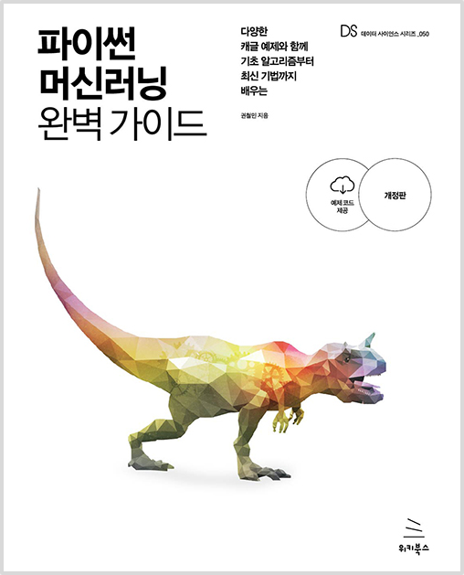

  
  <h1>파이썬 머신러닝 완벽 가이드</h1>
  

    
    
    
  

---

## ✅ CheckLists

- [ ] 책 1회독 하기
- [ ] 실습 내용 GitHub에 남기기
- [ ] 블로그에 책 리뷰하기

---

## 👩‍💻 Study Notes

| 챕터 |                 제목                 | 공부 날짜 |
| :--: | :----------------------------------: | :-------- |
|  1   | 파이썬 기반의 머신러닝과 생태계 이해 | 2019.09   |
|  2   |    사이킷런으로 시작하는 머신러닝    | 2019.09   |
|  3   |                 평가                 | 2019.10   |
|  4   |                 분류                 |           |
|  5   |                 회귀                 |           |
|  6   |              차원 축소               |           |
|  7   |                군집화                |           |
|  8   |             텍스트 분석              |           |
|  9   |             추천 시스템              |           |
